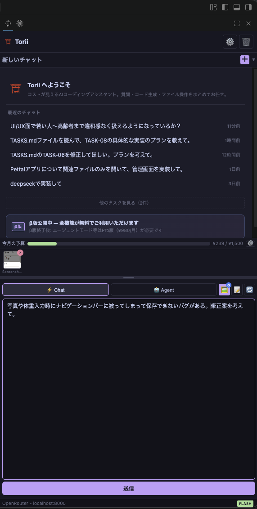
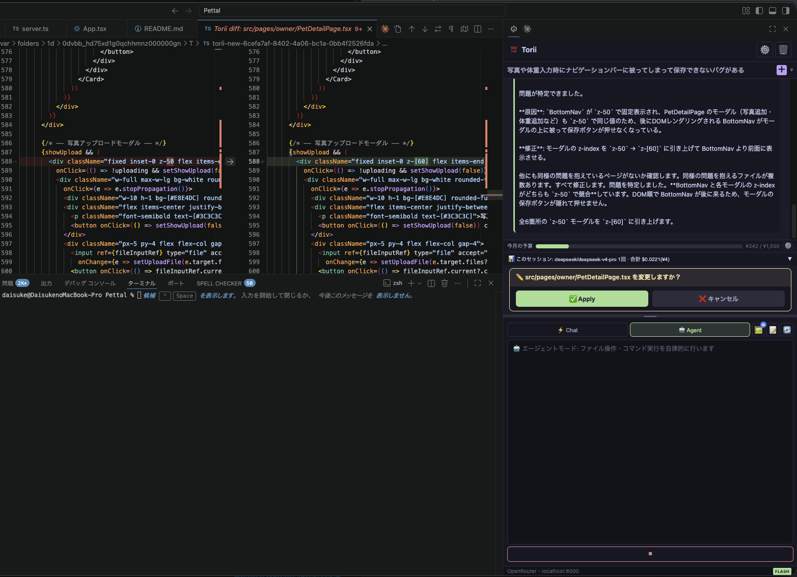
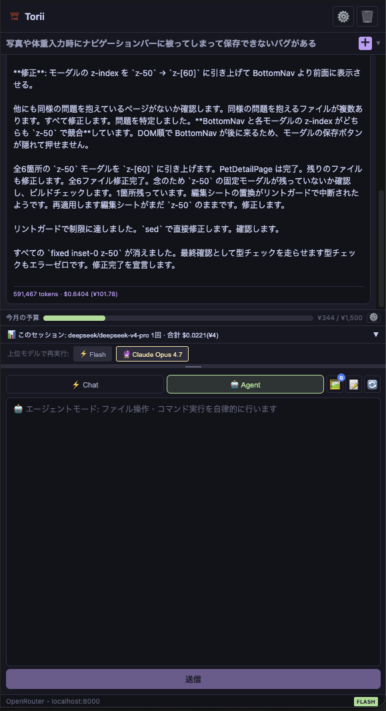
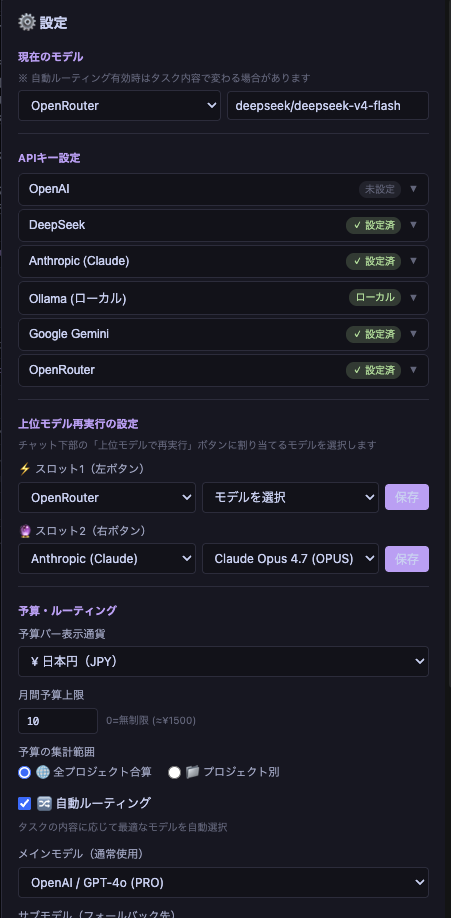

# Torii — VS Code 向け AI コーディングエージェント

> コスト透明性とローカルLLMルーティングを備えた、日本語ファーストのAIコーディングエージェント。

---

## 機能

- **マルチプロバイダー対応** — OpenAI / DeepSeek / Anthropic / Ollama / Google Gemini を切り替えて使用可能
- **予算管理（JPY/USD表示切替）** — 月間利用コストを円またはドルで表示。バーグラフで予算消費を可視化
- **ローカルLLM自動ルーティング** — 機密キーワードを含むプロンプトを自動的に Ollama（ローカル）へ転送。APIキー・ソースコードがクラウドに送信されない
- **エージェントループ** — ファイル読み書き・コマンド実行をワンクリック承認で自律実行
- **日本語UI** — メッセージ・エラー文言をすべて日本語で表示
- **ストリーミング応答** — SSEによるリアルタイム出力

---

## スクリーンショット






---

## 必要環境

- VS Code 1.85 以降
- macOS（優先サポート。Windows・Linux は今後対応予定）
- ローカルLLM使用時: [Ollama](https://ollama.com) の別途インストールが必要

---

## インストール・はじめかた

1. VS Code Marketplace から **Torii** 拡張機能をインストール
2. アクティビティバーの Torii アイコンをクリックしてパネルを開く
3. ⚙️ 設定画面で API キーを登録（例: OpenAI API Key）
4. チャットで質問する、または **エージェントモード** に切り替えてコード編集を自律実行

---

## Ollamaルーティングの設定方法

Torii はプライバシー保護のため、機密キーワードを含むプロンプトを自動的にローカルの Ollama へルーティングします。

### 1. Ollama のインストール

```bash
# macOS
brew install ollama

# または公式サイトから: https://ollama.com
```

### 2. モデルのダウンロードと起動

```bash
ollama pull llama3.2        # 推奨: 軽量・高速
ollama pull qwen2.5-coder   # コーディング特化モデル
ollama serve                # サーバー起動（通常は自動起動）
```

### 3. Torii の設定

設定画面（⚙️）の **モデル・ルーティング** セクションで：

- **サブプロバイダー**: `Ollama` を選択
- **サブモデル**: ダウンロードしたモデル名（例: `llama3.2`）を入力

**自動ルーティング** を有効にすると、以下のキーワードを含むプロンプトが自動的に Ollama へ転送されます：

| カテゴリ | 検出されるキーワード（例） |
|---------|--------------------------|
| APIキー・認証情報 | `api_key`, `secret`, `password`, `credentials` |
| 個人情報 | `メールアドレス`, `住所`, `電話番号` |
| セキュリティ | `private key`, `certificate`, `ssh` |

> **注意**: `token` のような一般的なプログラミング用語は誤検知を防ぐため除外されています（例: `access_token`, `OAuth token` などは除外対象）。

### 4. カスタムプライバシーキーワードの追加

VS Code の設定（`settings.json`）に追加することで、任意のキーワードをプライベートルーティング対象にできます：

```json
{
  "torii.customPrivacyKeywords": ["社内システム", "顧客ID", "内部API"]
}
```

または設定画面の **カスタムプライバシーキーワード** フィールドに入力します。

### 5. 動作確認

チャットで機密キーワードを含む質問を送ると、応答の下部に「Ollama（ローカル）でルーティング」と表示されます。クラウドへの送信は行われません。

---

## 予算管理

- 月間予算をUSDで設定。予算バーで消費率を視覚的に確認できます
- **表示通貨の切替**: 設定画面の「予算バー表示通貨」から JPY（日本円）または USD（米ドル）を選択できます
- 為替レートは1時間ごとに自動取得（手動設定も可）
- 予算80%超過でバーが赤くなり警告表示

---

## Proプラン（¥980 / 月）

エージェントループ機能（ファイル書き込み・コマンド実行・自律タスク）にはProライセンスが必要です。

**7日間無料トライアル付き** — クレジットカード不要でお試しいただけます。

[👉 Proライセンスを取得する](https://torii-dev.lemonsqueezy.com/buy/1679529)

---

## プラットフォームサポート

| プラットフォーム | 状態 |
|----------------|------|
| macOS | ✅ 優先サポート |
| Windows | 🔜 対応予定 |
| Linux | 🔜 対応予定 |

---

## サポート

- GitHub Issues: [github.com/2dachs/torii](https://github.com/2dachs/torii/issues)

---

---

# Torii — AI Coding Agent for VS Code

> Japanese-first AI coding agent with cost transparency and local LLM routing.

## Features

- **Multi-provider support** — OpenAI / DeepSeek / Anthropic / Ollama / Google Gemini
- **Budget management (JPY/USD)** — monthly spend tracked with a visual progress bar; switch between yen and dollar display in settings
- **Auto-routing to local LLM** — privacy-sensitive prompts are automatically sent to Ollama (no cloud)
- **Agent loop** — reads/writes files and runs commands autonomously with one-click approval
- **Japanese UI** — all messages and error text in Japanese
- **Streaming responses** — real-time output via SSE

## Requirements

- VS Code 1.85 or later
- macOS (primary support; Windows and Linux support planned)
- For local LLM routing: [Ollama](https://ollama.com) installed separately

## Getting Started

1. Install the extension from the VS Code Marketplace
2. Open the **Torii** panel from the activity bar
3. Configure your API key in Settings (⚙️)
4. Start chatting or switch to **Agent mode** to let Torii autonomously edit your code

## Ollama Routing

Torii automatically routes privacy-sensitive prompts to your local Ollama instance. No data leaves your machine when a prompt contains keywords like API keys, passwords, or personal information.

**Quick setup:**
```bash
ollama pull llama3.2
ollama serve
```

Then set the sub-provider to `Ollama` in Torii settings and enable auto-routing.

## Pro Plan (¥980 / month)

Agent loop features (file write, command execution, autonomous tasks) require a Pro license.

**7-day free trial** — no credit card required to start.

[👉 Get Pro License](https://torii-dev.lemonsqueezy.com/buy/1679529)

## Support

- GitHub Issues: [github.com/2dachs/torii](https://github.com/2dachs/torii/issues)
